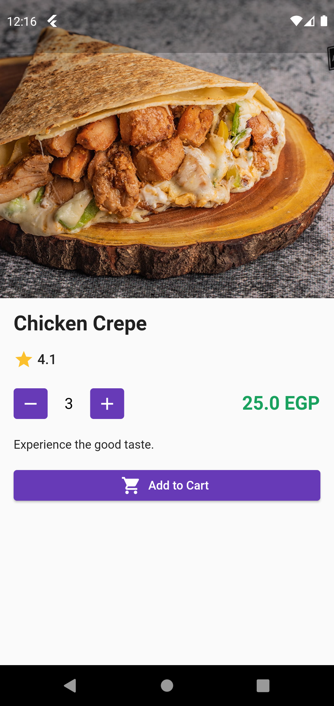

# GUCiano

Mobile Application Development Project

### Overview

Our application allows the GUC students and staff to order food online and receive their order on the go or get the order delivered to the GUC dorms in Rehab if they live there.

### Problems The App Solves

- The user can pay using a credit card instead of cash.
- If the restaurant doesn't have change, the amount will be added to the user's wallet.
- The user can order the food early without needing to stand in a long queue.
- The user can get the order delivered to the dorms if they live there without needing to go to the campus to reserve the order.
- The user can use the app offline, as data is cached once they are fetched, including the user’s cart, so that they can still explore the food menu and modify their cart even if they don’t have internet access, which is a common problem at the campus.

### Features
* Authentication

  Users can log in to the app using the university email and password, as it is a part of the university system.
  

    
    
  

* Food Menu 

  There are multiple categories such as drinks, sandwiches, meals, etc. and each category has its own menu.
When a category is clicked, its items are shown below it.
  

    
    
  

* Item Details

  Each item has its own details. When the user clicks on the Add to Cart button, it will get added to the user’s cart.
  

    
    
  

* Cart

   Users can add items to their cart as well as modify it by changing the items count or removing them from the cart.
  

    
    
  

* Checkout

  When the user proceeds to checkout, they would need to select the pickup method and payment method, and write optional extra notes. If the user already has some balance in their wallet, it will automatically deduct the order’s total price.
  - Pickup Method Options
    1. Pickup at Kiosk
    2. Delivery to Dorm
  - Payment Method Options
    1. Cash
    2. Debit / Credit Card

  

    
    
  

* Checkout Payment

  If the user selects Debit / Credit Card, a slider will appear below it, in which the user would need to enter their card details, including the card number, expiry date and CVC. If the user enters any incorrect or missing data, an error will be displayed.
Once the user proceeds and places the order, the payment is done through Stripe.
  

    
    
  

* Previous Orders

  Users can also view their previous orders. When an order is clicked, it will expand, showing the order items.
  

    
    
  

  
* Push Notifications

  When the order status gets updated, a notification is sent to the user. This can happen in three cases:
If the pickup method is Pickup at Kiosk, a notification will be sent when the order is ready.
If the pickup method is Delivery to Dorm, a notification will be sent when the order is on the way, and another one when it is delivered.
  

    
    
  

* User Profile
  
  Users can view their name, email, phone number and available balance (user’s wallet). The available balance gets incremented when the user pays by cash and should get some change, while the cashier doesn’t have enough change to return.
  

    
  
  
### Libraries and Packages Used
- [Cloud Firestore](https://pub.dev/packages/cloud_firestore)
- [Firebase Auth](https://pub.dev/packages/firebase_auth)
- [Provider](https://pub.dev/packages/provider)
- [Email Validator](https://pub.dev/packages/email_validator)
- [Firebase Messaging](https://pub.dev/packages/firebase_messaging)
- [Http](https://pub.dev/packages/http)
- [Flutter Local Notification](https://pub.dev/packages/flutter_local_notifications)
- [Shimmer](https://pub.dev/packages/shimmer)
- [Stripe](https://pub.dev/packages/flutter_stripe)  

